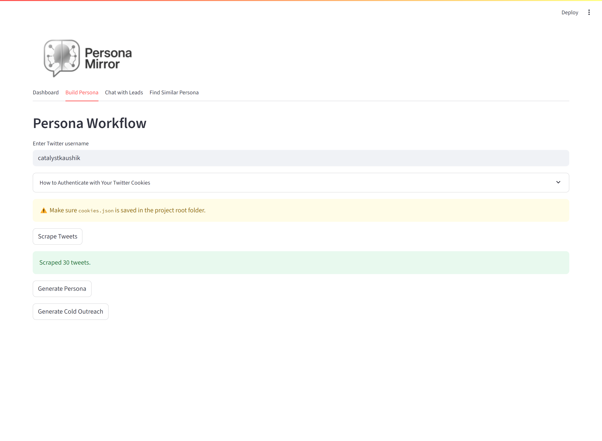
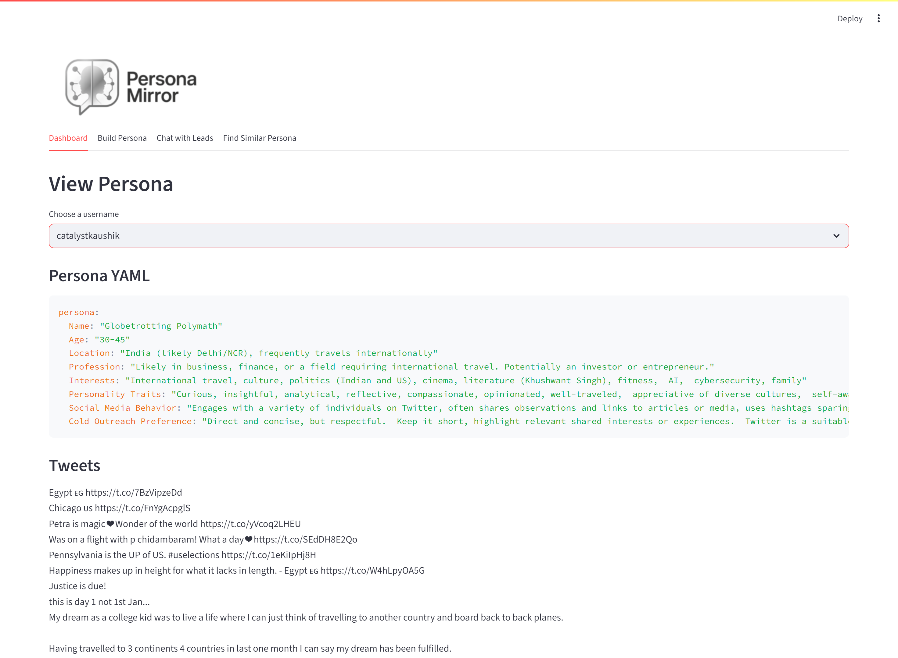
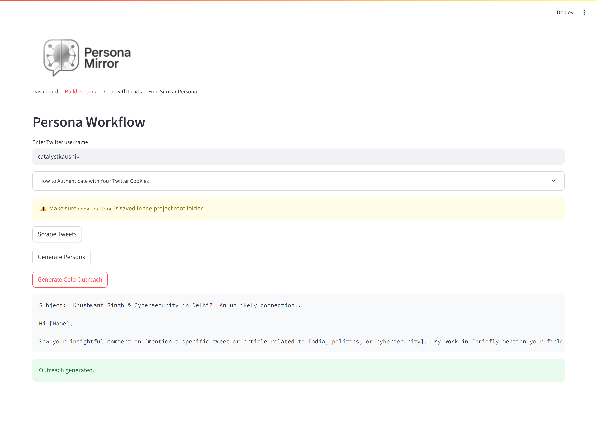
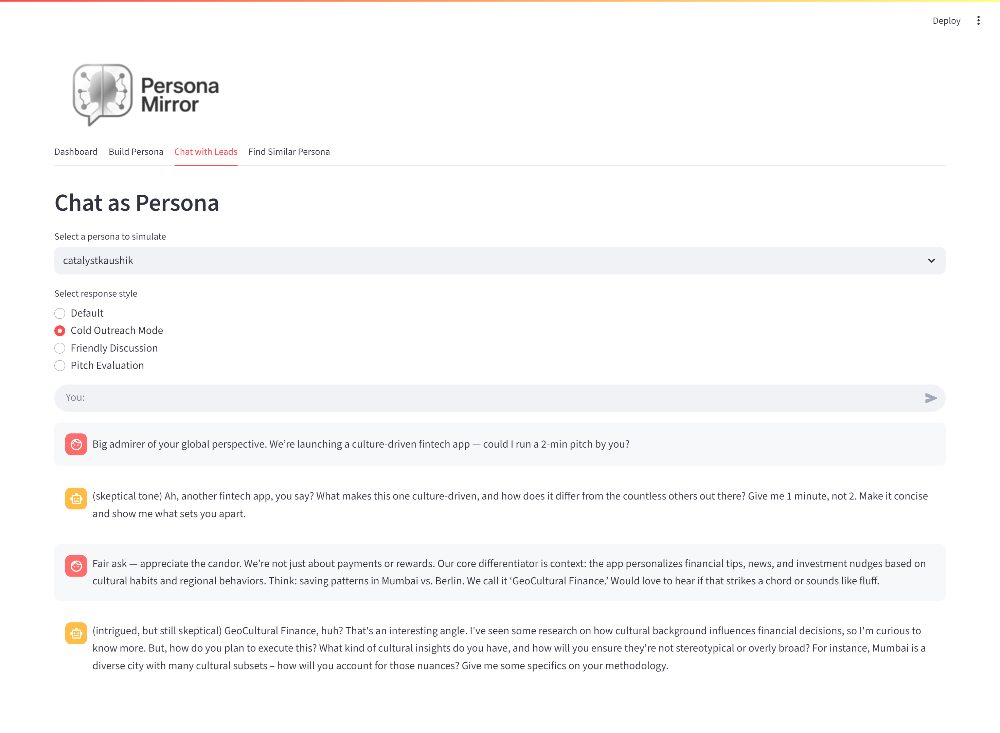
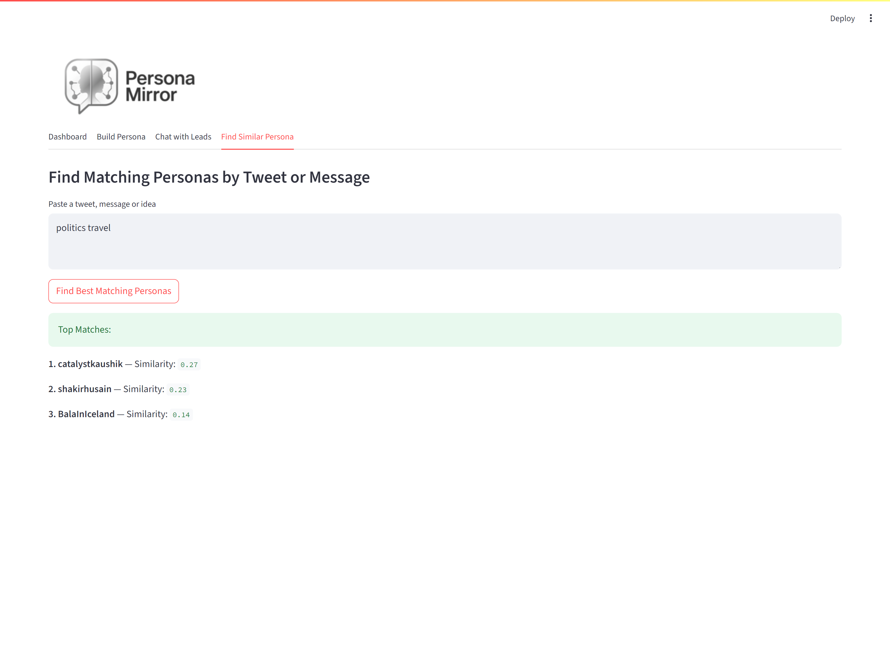

# PersonaMirror


**AI-Powered Lead Profiling and Cold Outreach Simulation**

PersonaMirror is a web-based tool that helps marketers, founders, and researchers understand online leads better by analyzing public Twitter/X data. Using Generative AI models, it builds a structured persona, generates personalized outreach messages, and simulates how the individual might respond in a real conversation.

---

## Features

- Scrape tweets from any public Twitter/X account using your own browser session cookies
- Generate a structured YAML persona profile using Gemini 1.5 Flash
- Automatically draft cold outreach emails tailored to the persona
- Simulate conversations using Groq's LLaMA3 model to test how a persona might respond
- Measure similarity between generated personas and an ideal customer profile using cosine similarity
- Streamlit-based interface with a clean dashboard and workflow separation

---

## Screenshots

### Persona Workflow Tab

This section handles username input, tweet scraping, persona generation, and outreach creation.



---

### Dashboard View

Displays the generated YAML persona, the scraped tweets, and the outreach email.



---

### Cold Outreach Generator

Auto-generates email based on the persona's interests, tone, and communication preferences.



---

### Chatbot Simulation

Simulates conversation responses using Groq's LLaMA3 to test cold outreach effectiveness.



---

### Persona Similarity Feature

Compares the lead with an ideal customer profile using cosine similarity.



---

## How to Run

### 1. Clone the Repository

```bash
git clone https://github.com/vamsikrishnap23/PersonaMirror.git
cd persona_mirror
```

### 2. Install Dependencies

Create and activate a virtual environment:

```bash
python -m venv venv
venv\Scripts\activate   # On Windows
# or
source venv/bin/activate  # On Unix-based systems

pip install -r requirements.txt
```

### 3. Set Up API Keys

Create a `.env` file and include:

```env
GEMINI_API_KEY=your_google_gemini_key
GROQ_API_KEY=your_groq_key
```

These are used for persona generation and chatbot simulation.

### 4. Twitter/X Cookie Setup

Tweet scraping requires your own browser session cookies. This is not automated to protect your privacy.

**Steps:**

1. Install the EditThisCookie browser extension
2. Visit https://x.com and log into your account
3. Export all cookies to a file named `raw_cookies.json`
4. Run the included script to extract only the required cookies:

```bash
python reformat_cookies.py
```

### 5. Run the Application

```bash
streamlit run dashboard.py
```

---

## Use Cases

- Evaluate whether a Twitter account fits a startup's target audience
- Personalize email communication based on interests and tone
- Simulate lead reactions to outreach
- Quickly segment or qualify prospects for B2B or community growth

---

## Requirements

- Python 3.8+
- Valid Google Gemini API key
- Valid Groq API key
- Active Twitter/X account for cookie extraction

---

## Project Structure

```
persona_mirror/
├── dashboard.py             # Streamlit dashboard UI
├── generate_outreach.py     # Generates cold outreach emails
├── generate_persona.py      # Generates persona YAML from tweets
├── login.py                 # Cookie-based Twitter login
├── persona_similarity.py    # Persona cosine similarity matching
├── reformat_cookies.py      # Script to clean cookies from EditThisCookie
├── requirements.txt         # Python dependencies
├── scrape_tweets.py         # Scrapes tweets using Twikit
├── simulate_persona_groq.py # Chat simulation using Groq LLaMA3
├── utils.py                 # Helper utilities (paths, loaders, etc.)
├── README.md                # Project documentation
├── .gitignore               # Files to ignore in Git
├── images/                  # Screenshots and logos
│   └── (logo1.png, screenshots...)

```

---

## Project Info

- **Title:** PersonaMirror
- **Author:** Vamsi Krishna
- **Date:** July 2025

---
